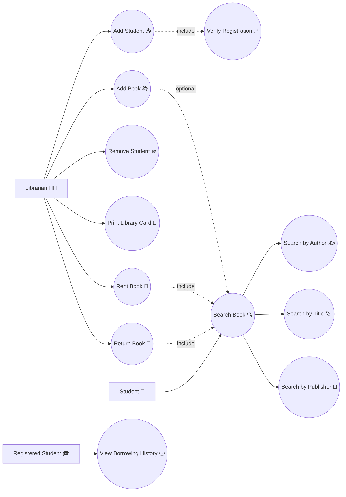
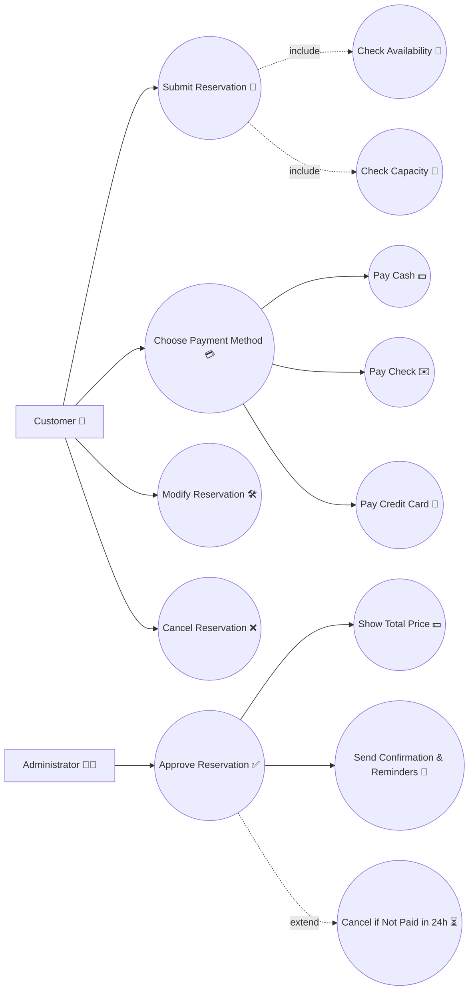
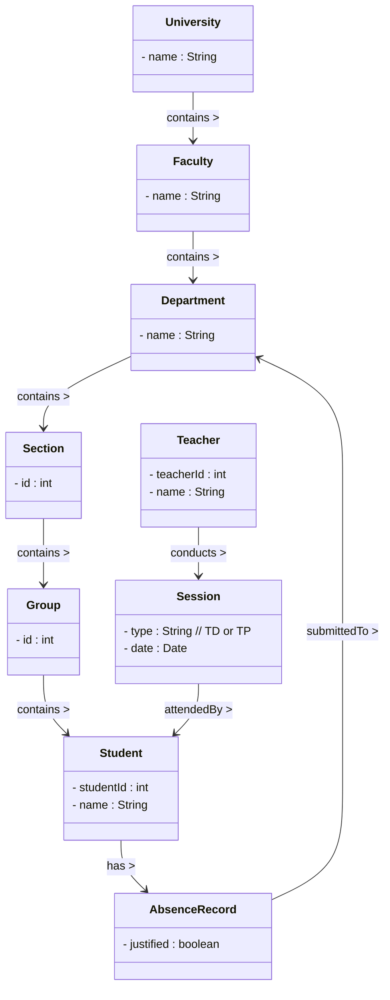
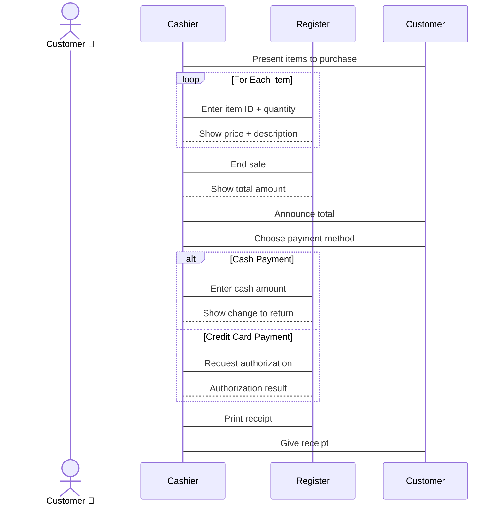
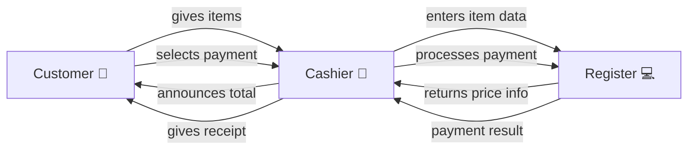

# 📚 **Course Scenarios (Rewritten & Improved)**

## **Scenario 1 — Library Management System**

This system helps a librarian manage students and books in a library.

### 🎭 **Actors**

|Actor|Description|
|---|---|
|**Librarian 👩‍💼**|Manages students and books.|
|**Any Student 🎒**|Can search for books.|
|**Registered Student 🎓**|Can view their borrowing history.|

### 🎯 **Main Goals**

- Add or remove students.
    
- Create library cards.
    
- Add books into the system.
    
- Search for books (by title, author, or publisher).
    
- Rent and return books.
    
- View borrowing history (only for registered students).
    

### 🧠 **Important Relationships**

- When adding a student → the system must **verify registration**.
    
- To rent or return a book → the librarian must first **search for the book**.
    
- Searching can be done by **Title**, **Author**, or **Publisher**.
    

---

## 🏨 **Scenario 2 — Hotel Reservation System**

This system manages hotel room bookings.

### 🎭 **Actors**

|Actor|Description|
|---|---|
|**Customer 🧑‍💼**|Requests and manages reservations.|
|**Administrator 🧑‍💻**|Approves reservations and manages availability.|

### 🎯 **Main Goals**

- Customers register an account.
    
- Customers submit reservation requests.
    
- System checks room **availability** and **capacity**.
    
- Admin either **approves** or **rejects** the request.
    
- Customer chooses a payment method:
    
    - Cash 💵
        
    - Check 🧾
        
    - Credit Card 💳
        
- System sends confirmation and reminders.
    

### 🧠 **Important Relationships**

- Reservation approval triggers **price calculation** and **notification sending**.
    
- Payment choice leads to **different payment processes**.
    

---

## 🛍️ **Scenario 3 — Store Checkout Payment (Collaboration & Sequence)**

This system handles payment at a store checkout.

### 🎭 **Actors / Participants**

|Participant|Role|
|---|---|
|**Customer 🧍‍♂️**|Buys items and pays.|
|**Cashier 👩‍💼**|Scans items and handles payment.|
|**Register 💻**|Calculates totals and prints receipt.|

### 🔄 **Process Steps**

1. Customer gives items to cashier.
    
2. For each item → the cashier enters item code.
    
3. Register displays item details and prices.
    
4. Cashier announces total cost.
    
5. Customer selects a payment method.
    
6. Register processes payment.
    
7. Cashier gives receipt to customer.
    

---

## 🍎 **Scenario 4 — Attendance Management System (Class Diagram)**

This system tracks student absences and teacher sessions.

### 🎭 **Main Entities**

|Entity|Meaning|
|---|---|
|University 🏫|Contains multiple faculties.|
|Faculty 🧑‍🏫|Contains multiple departments.|
|Department 🏢|Contains multiple sections.|
|Section 🎒|Contains groups of students.|
|Group 👥|Contains students.|
|Teacher 👨‍🏫|Conducts teaching sessions.|
|Student 🧑‍🎓|Attends sessions.|
|Absence Record 📄|Tracks whether absence is justified.|

### 🔗 **Relationships**

- Organization is hierarchical (University → Faculty → Department → Section → Group → Students).
    
- Each **Teacher** runs **Sessions**.
    
- **Students** attend sessions → absence recorded.
    
- Absence record is linked to student and department.
    

---
# 🎨 **Exercise 1 — Library System (Horizontal + Emojis)**

# 🎨 **Exercise 2 — Hotel Reservation (Horizontal + Emojis)**

---
# 🏫 **Exercise 3 — Class Diagram (NTIC Faculty Attendance System)**

---

### 🎯 Interpretation

- University contains **Faculties**
    
- Faculties contain **Departments**
    
- Departments contain **Sections**
    
- Sections contain **Groups**
    
- Groups contain **Students**
    
- **One teacher** conducts each session
    
- After each session, the teacher marks **absent students**
    
- Absent students must **submit justification** to the department
    

---

# 🔄 **Exercise 4 — Sequence Diagram (Checkout Payment Process)**

# 🤝 **Collaboration Diagram (Same Scenario)**

✅ Same logic, but shows **object interactions** as a network  
✅ Works in **Obsidian**

